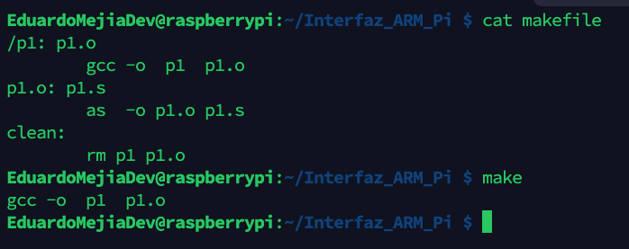

------

<pre>

	

Tecnológico Nacional de México
Instituto Tecnológico de Tijuana

Departamento de Sistemas y Computación
Ingeniería en Sistemas Computacionales

Semestre:
Febrero - Junio 2022

Materia:
Lenguajes de interfaz

Docente:
M.C. Rene Solis Reyes 

Unidad:
3

Título del trabajo:
Cierre Tema 3 

Estudiante:
Mejia Cruz Jose Eduardo - 18210500

	

</pre>

---

# Ejecucion de P1

# Ejecucion de P2

# Ejecucion de P3

# Ejecucion de P4

# Ejecucion de P5

# Ejecucion de P7

# Ejecucion de P8

# Ejecucion de P9

# Ejecucion de P10

# Ejecucion de P11

# Ejecucion de P12

# Ejecucion de P13

# Ejecucion de P14

# Ejecucion de P15

# Ejecucion de P16

# Ejecucion de P17

# Ejecucion de P18

